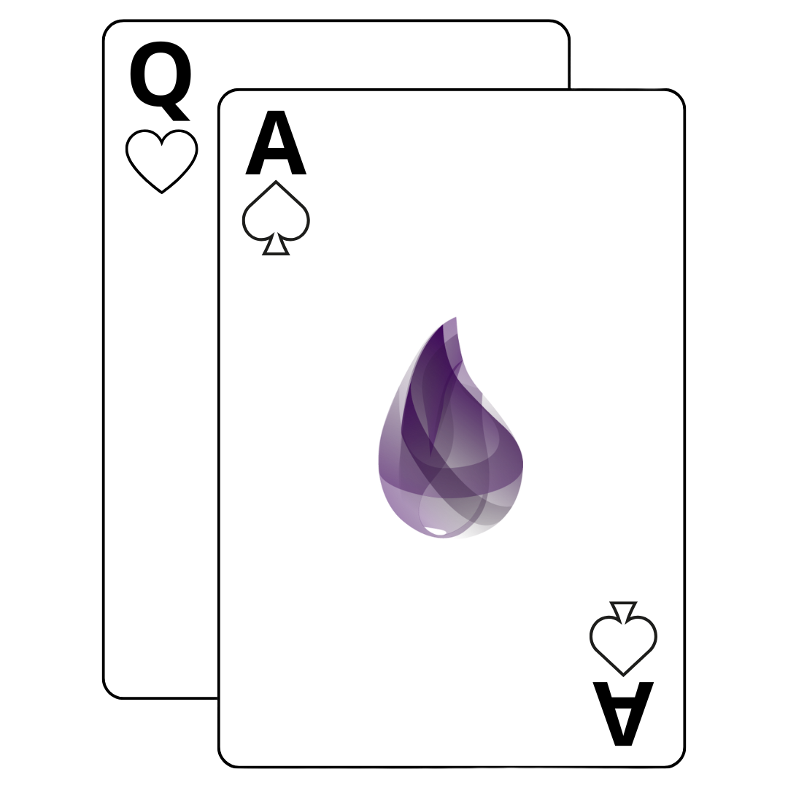
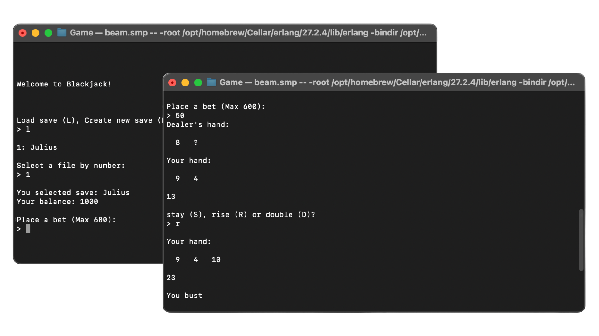

<!-- Improved compatibility of back to top link: See: https://github.com/othneildrew/Best-README-Template/pull/73 -->
<a id="readme-top"></a>
<!--
*** Thanks for checking out the Best-README-Template. If you have a suggestion
*** that would make this better, please fork the repo and create a pull request
*** or simply open an issue with the tag "enhancement".
*** Don't forget to give the project a star!
*** Thanks again! Now go create something AMAZING! :D
-->


<!-- PROJECT LOGO -->
<br />
<div align="center">
  <a href="https://github.com/jekahk/ElixirBlackjack">
    
  </a>

<h3 align="center">Elixir Blackjack</h3>

  <p align="center">
    A terminal based Blackjack (Twenty-one) card game written with Elixir programming language.
    <br />
    This project is done for University's course Programming Paragrams in Practice.
    <br />
  </p>
</div>


<!-- TABLE OF CONTENTS
<details>
  <summary>Table of Contents</summary>
  <ol>
    <li>
      <a href="#about-the-project">About The Project</a>
      <ul>
        <li><a href="#built-with">Built With</a></li>
      </ul>
    </li>
    <li>
      <a href="#getting-started">Getting Started</a>
      <ul>
        <li><a href="#prerequisites">Prerequisites</a></li>
        <li><a href="#installation">Installation</a></li>
      </ul>
    </li>
    <li><a href="#usage">Usage</a></li>
    <li><a href="#roadmap">Roadmap</a></li>
    <li><a href="#contributing">Contributing</a></li>
    <li><a href="#license">License</a></li>
    <li><a href="#contact">Contact</a></li>
    <li><a href="#acknowledgments">Acknowledgments</a></li>
  </ol>
</details>
 -->

<!-- ABOUT THE PROJECT -->
## About The Project

<div align="center">
  
</div>

The task for this project was to select a programming language that was new for the student and then use it to build some sort of game. The game idea could be selected from a predetermined list, or the student could come up with an own idea. The purpose was to get to know a new programming language and concentrate on how this language supported this programming project. This project idea was selected from the predetermined list. The project could be done as solo or in a group up to 4 persons. This project was done solo. 

This project started with some initial brainstorming about what the finished game should include. The initial plan can be viewed in the "initial ideas.txt" document. The product of this project is a terminal based Blackjack, other name Twenty-one, card game written whit Elixir programming language. The game has a save system that keeps track of the players balance, betting system and simple interface that displace the dealers hand and the players’ hand.


### Built With

* [![Elixir][Elixir]][Elixir-url]


<p align="right">(<a href="#readme-top">back to top</a>)</p>


<!-- GETTING STARTED 
## Getting Started

This is an example of how you may give instructions on setting up your project locally.
To get a local copy up and running follow these simple example steps.

### Prerequisites

This is an example of how to list things you need to use the software and how to install them.
* npm
  ```sh
  npm install npm@latest -g
  ```

### Installation

1. Get a free API Key at [https://example.com](https://example.com)
2. Clone the repo
   ```sh
   git clone https://github.com/github_username/repo_name.git
   ```
3. Install NPM packages
   ```sh
   npm install
   ```
4. Enter your API in `config.js`
   ```js
   const API_KEY = 'ENTER YOUR API';
   ```
5. Change git remote url to avoid accidental pushes to base project
   ```sh
   git remote set-url origin github_username/repo_name
   git remote -v # confirm the changes
   ```

<p align="right">(<a href="#readme-top">back to top</a>)</p>

 -->

<!-- USAGE EXAMPLES 
## Usage

Use this space to show useful examples of how a project can be used. Additional screenshots, code examples and demos work well in this space. You may also link to more resources.

_For more examples, please refer to the [Documentation](https://example.com)_

<p align="right">(<a href="#readme-top">back to top</a>)</p>

<!-- ROADMAP  -->
## Improvement ideas

- [ ] Configuration support
    - [ ] Inital bet ammount
    - [ ] Max bet limit
    - [ ] Deck customization
- [ ] Better graphical interface

<p align="right">(<a href="#readme-top">back to top</a>)</p>


<!-- CONTRIBUTING
## Contributing

Contributions are what make the open source community such an amazing place to learn, inspire, and create. Any contributions you make are **greatly appreciated**.

If you have a suggestion that would make this better, please fork the repo and create a pull request. You can also simply open an issue with the tag "enhancement".
Don't forget to give the project a star! Thanks again!

1. Fork the Project
2. Create your Feature Branch (`git checkout -b feature/AmazingFeature`)
3. Commit your Changes (`git commit -m 'Add some AmazingFeature'`)
4. Push to the Branch (`git push origin feature/AmazingFeature`)
5. Open a Pull Request

<p align="right">(<a href="#readme-top">back to top</a>)</p>

### Top contributors:

<a href="https://github.com/github_username/repo_name/graphs/contributors">
  
</a>

 -->

<!-- LICENSE
## License

Distributed under the project_license. See `LICENSE.txt` for more information.

<p align="right">(<a href="#readme-top">back to top</a>)</p>

 -->

<!-- CONTACT
## Contact

Julius Kähkönen - [@twitter_handle](https://twitter.com/twitter_handle) - email@email_client.com

Project Link: [https://github.com/github_username/repo_name](https://github.com/github_username/repo_name)

<p align="right">(<a href="#readme-top">back to top</a>)</p>

 -->

<!-- ACKNOWLEDGMENTS
## Acknowledgments

* []()
* []()
* []()

<p align="right">(<a href="#readme-top">back to top</a>)</p>

 -->

<!-- MARKDOWN LINKS & IMAGES -->
<!-- https://www.markdownguide.org/basic-syntax/#reference-style-links -->

[Elixir]: https://img.shields.io/badge/Elixir-20232A?style=for-the-badge&logo=elixir&logoColor=48205D
[Elixir-url]: https://elixir-lang.org/
[product-screenshot]: screenshots/screenshot-combined.png
